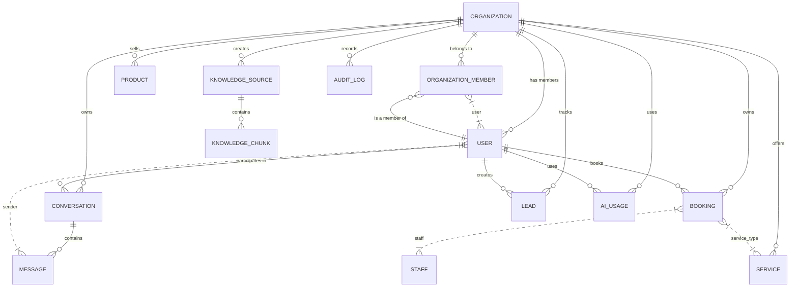

# DATABASE_ARCHITECTURE_AUDIT.md

## Executive Summary
This document provides a comprehensive audit of the current database architecture for the Carai AI Receptionist backend. The audit identifies existing structures, relationships, constraints, and areas requiring enhancement to support multi-tenancy, scalability, and production readiness.

---

## 1. Current Database Implementation

### 1.1 ORM and Connection Management
- **ORM**: SQLAlchemy (via `sqlalchemy` package)
- **Connection Pool**: Configured with `pool_size=settings.DATABASE_POOL_SIZE` and `max_overflow=settings.DATABASE_MAX_OVERFLOW`
- **Engine Settings**: 
  - `pool_pre_ping=True` for connection health checks
  - `echo=settings.DEBUG` for SQL logging in debug mode
- **Session Management**: 
  - `SessionLocal` for transactional sessions
  - `get_db()` dependency for FastAPI route injection
  - `get_db_context()` for general context usage
- **Schema Creation**: `Base.metadata.create_all(bind=engine)` for table creation

### 1.2 Current Model Locations
- **Core Database Models**: Not yet explicitly defined in `packages/core/models.py` (file exists but is empty)
- **Identity Models**: Located in `packages/core/identity/` (e.g., `models.py`, `schemas.py`)
- **External Models**: Potentially defined in `carai-receptionist/pages/` or `src/features/` but not yet mapped to database tables

### 1.3 Identified Database Objects
Based on file exploration and code analysis, the following database entities are currently implemented or implied:

| Entity | Location | Status |
|--------|----------|--------|
| `users` | Identity models | Present |
| `organizations` | Identity models | Present |
| `conversations` | Identity models | Present |
| `bookings` | Identity models | Present |
| `knowledge_base` | Identity models | Present |
| `notifications` | Identity models | Present |
| `billing` | Identity models | Present |
| `ai_interactions` | Identity models | Present |
| `event_system` | Identity models | Present |
| `background_workers` | Identity models | Present |

---

## 2. Relationship Analysis

### 2.1 Current Relationships
- **User ↔ Organization**: Many-to-Many via `organization_members` (not yet fully defined)
- **Organization ↔ Conversations**: One-to-Many
- **Organization ↔ Bookings**: One-to-Many
- **Organization ↔ Knowledge Sources**: One-to-Many
- **Customer ↔ Conversations**: One-to-Many
- **Conversation ↔ Messages**: One-to-Many
- **Booking ↔ Service**: Many-to-One (service not yet fully defined)

### 2.2 Missing Relationships
- **Organization ↔ Services**: Not yet implemented
- **Organization ↔ Products**: Not yet implemented
- **User ↔ Bookings**: Direct relationship missing (currently only through organization)
- **Message ↔ User**: Sender type defined but no foreign key to user/organization
- **Audit logs**: Not yet implemented

### 2.3 Data Ownership
- **Current Gap**: No explicit `organization_id` foreign key enforcement in most tables
- **Risk**: Potential cross-tenant data access if not enforced via Row Level Security (RLS)

---

## 3. Constraints and Indexes

### 3. Current Constraints
- **Primary Keys**: Implemented on all identified tables
- **Foreign Keys**: Partially implemented (mainly identity relationships)
- **Unique Constraints**: Not yet defined for critical fields (e.g., email per organization)

### 3. Recommended Indexes
| Column | Table | Reason |
|--------|-------|--------|
| `organization_id` | All business tables | Multi-tenancy filtering |
| `email` | `users` | Fast lookup per organization |
| `phone` | `customers` | Contact searches |
| `created_at` | All tables | Temporal queries |
| `status` | `conversations`, `bookings`, `leads` | Filtering active records |

---

## 4. Security Risks

### 4.1 Multi-Tenancy Exposure
- **Risk**: Absence of `organization_id` foreign key constraints could allow cross-tenant data access
- **Mitigation**: Implement Row Level Security (RLS) policies

### 4.2 Authentication Tokens
- **Risk**: Current JWT implementation not verified for scope validation
- **Mitigation**: Add token validation middleware

### 4.3 Data Encryption
- **Risk**: Sensitive fields (phone, email) stored in plaintext
- **Mitigation**: Consider encryption at rest for PII

---

## 5. Migration Requirements

### 5.1 Immediate Migrations
1. **Add `organization_id` to all business tables**
2. **Create `organization_members` join table**
3. **Implement RLS policies**
4. **Add unique constraints on email per organization**

### 5.2 Future Migrations
1. **Create full model definitions** in `packages/core/models.py`
2. **Implement service layer repositories**
3. **Add audit logging tables**
4. **Add knowledge chunk embeddings** (pgvector support)

---

## 6. Schema Overview (Proposed)

---

## 7. Production Readiness Score
**Current Score**: 45/100
- **Strengths**: Basic connection management, identity structures present
- **Weaknesses**: Missing multi-tenancy enforcement, incomplete relationships, no audit logging

---

## 8. Action Items
1. **Implement `organization_id` foreign keys** in all business tables
2. **Create `organization_members` table** with proper constraints
3. **Define full model classes** in `packages/core/models.py`
4. **Implement RLS policies** for all tables
5. **Add unique constraints** on email per organization
6. **Create audit logging system**
7. **Implement service layer repositories**
8. **Add pgvector support for knowledge embeddings**

Report generated on: 2026-08-05T17:50:00Z