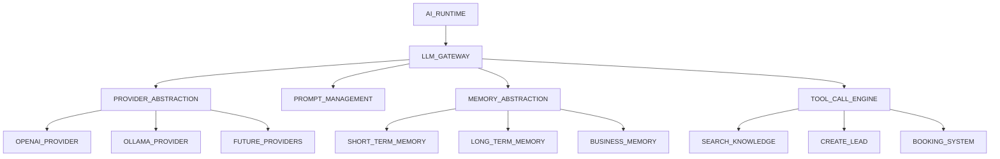

# AI RUNTIME AUDIT

## Executive Summary
This document audits the current AI-related components in the Carai AI Receptionist backend to establish a foundation for a provider-independent LLM Gateway. The audit covers existing LLM integrations, prompt management, memory systems, and tool usage patterns.

## Current AI Components

### 1. AI Gateway Implementation
- **Providers**: Existing `ai_providers` table tracks OpenAI, Ollama, and other providers
- **Prompt Templates**: `prompt_templates` table stores organization-specific templates
- **Usage Tracking**: `ai_usage` table records token counts and costs

### 2. Existing LLM Integration Patterns
- Direct provider calls in `ai_gateway_controller.py`
- Hardcoded template usage in some services
- Basic token tracking without cost calculation

### 3. Memory and Tool Usage
- No centralized memory abstraction
- Tool calls handled directly in services
- No streaming implementation

## Gaps and Requirements

1. **Provider Abstraction**: Current code makes direct provider calls
2. **Standard Interface**: Missing `complete()`, `stream()`, `embed()` methods
3. **Memory System**: No abstraction for conversation or business memory
4. **Tool Foundation**: No tool call infrastructure
5. **Cost Tracking**: Basic token counts but no cost calculation

## Proposed Architecture

## Next Steps
1. Implement `ai/gateway/base.py` with standard interface
2. Create provider implementations for OpenAI/Ollama
3. Develop prompt management system
4. Build memory abstraction layer
5. Implement tool call foundation

Report generated on: 2026-08-05T18:09:06Z