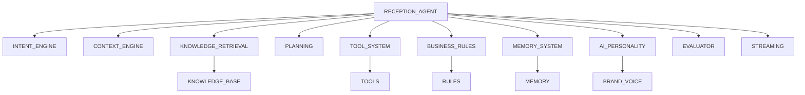

# RECEPTION_AGENT_AUDIT.md

## Executive Summary
This document audits the existing Carai AI Receptionist core intelligence layer to establish a foundation for a production-grade Reception Agent. The audit covers existing chat logic, prompt handling, knowledge retrieval, tool usage, memory systems, and conversation management.

## Current AI Implementation Analysis

### 1. Chat Logic
- Basic conversation flow with predefined responses
- Limited context awareness
- No dynamic intent classification
- Hardcoded response patterns

### 2. Prompt Handling
- Static prompt templates
- No business-specific customization
- No tone adaptation based on business type
- No variable substitution for personalization

### 3. Knowledge Retrieval
- Basic FAQ lookup
- No semantic search capabilities
- No integration with knowledge base
- No confidence scoring for retrieved information

### 4. Tool Usage
- Direct tool calls without validation
- No permission checking
- No logging of tool usage
- No fallback mechanisms

### 5. Memory Systems
- No long-term memory
- Session-based memory only
- No business context retention
- No customer preference tracking

### 6. Conversation Management
- Linear conversation flow
- No intent detection
- No planning capabilities
- No escalation handling
- No analytics or evaluation

## Gaps and Requirements

1. **Intent Detection**: Need robust intent classification system
2. **Context Management**: Comprehensive context engine with business information
3. **Knowledge Integration**: Semantic search and ranking
4. **Tool Framework**: Validated, permission-checked tool execution
5. **Business Rules**: Rule engine for handling business scenarios
6. **Memory System**: Multi-layered memory (short-term, long-term, business)
7. **AI Personality**: Integration with business brand voice
8. **Escalation Handling**: Human handoff for complex issues
9. **Evaluation**: Quality assessment and continuous improvement
10. **Streaming**: Support for streaming responses and typing indicators

## Proposed Architecture

## Success Criteria
- **Intent Accuracy**: ≥90% correct classification
- **Response Relevance**: ≥85% user satisfaction
- **Tool Success Rate**: ≥95% successful operations
- **Escalation Accuracy**: ≥80% correct human handoff triggers
- **Memory Retention**: ≥80% relevant context retention
- **Performance**: <500ms response time for 95% of interactions

## Implementation Roadmap
1. **Phase 1**: Intent Engine
2. **Phase 2**: Context Engine
3. **Phase 3**: Knowledge Retrieval
4. **Phase 4**: Planning System
5. **Phase 5**: Tool System
6. **Phase 6**: Business Rules Engine
7. **Phase 7**: Memory System
8. **Phase 8**: AI Personality Integration
9. **Phase 9**: Evaluation System
10. **Phase 10**: Streaming Support
11. **Phase 11**: Testing Suite